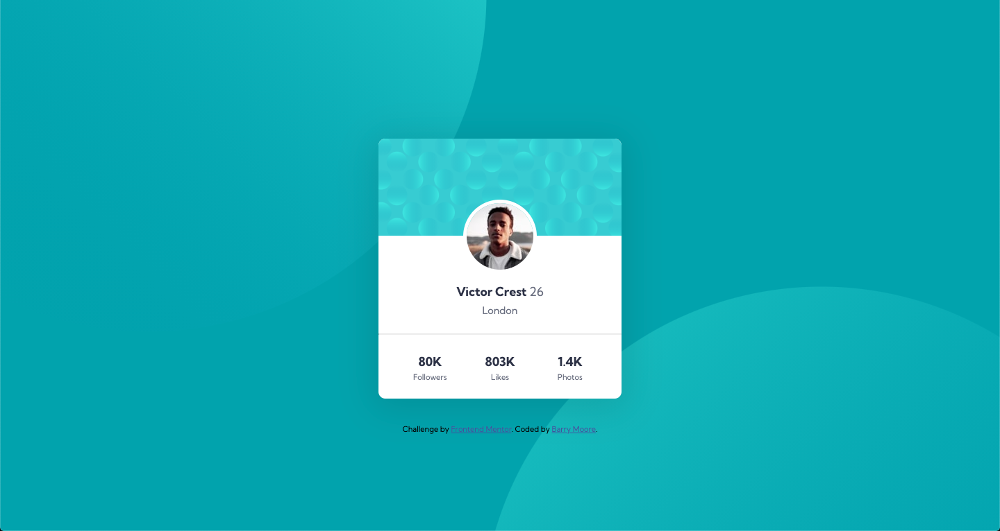
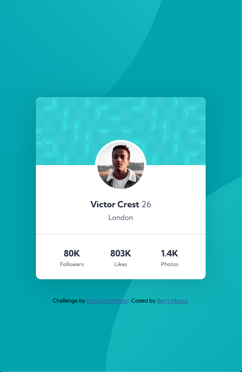

# Frontend Mentor - Profile card component solution

This is a solution to the [Profile card component challenge on Frontend Mentor](https://www.frontendmentor.io/challenges/profile-card-component-cfArpWshJ). Frontend Mentor challenges help you improve your coding skills by building realistic projects.

## Table of contents

- [Overview](#overview)
  - [The challenge](#the-challenge)
  - [Screenshot](#screenshot)
  - [Links](#links)
- [My process](#my-process)
  - [Built with](#built-with)
  - [What I learned](#what-i-learned)
  - [Continued development](#continued-development)
  - [Useful resources](#useful-resources)
- [Author](#author)
- [Acknowledgments](#acknowledgments)

## Overview

### The challenge

- Build out the project to the designs provided

### Screenshots

Desktop View

Mobile View

### Links

- Solution URL: [Frontend Mentor Solution](https://www.frontendmentor.io/solutions/mobile-first-3-column-display-KjB8xAY9w)
- Live Site URL: [Live Site](https://bmoore15v.github.io/FM-Profile-Card/)

## My process

### Built with

- Semantic HTML5 markup
- Custom CSS properties
- Flexbox
- Mobile-first workflow

### What I learned

This challenge gave me some issues with placing backgroud images. I learned more about `backgroound-position` and how to move images to the correct place.

### Continued development

I would like to woke more on `position`. I had a hard time figuring out how to positoion a few elements and how they relate to the rest of the elements. Additionally, I would like to grow in my understanding of adding CSS elements. I would add things and then that would break other things.

## Author

- Website - [To Work & Keep](https://www.toworkandkeep.com)
- LinkedIn - [Let's Connect](https://www.linkedin.com/in/bmoore15v/)
- Frontend Mentor - [@bmoore15v](https://www.frontendmentor.io/profile/bmoore15v)
- Twitter - [@bmoore15v](https://www.twitter.com/bmoore15v)

## Acknowledgments

Thanks to [Dr. Angela Yu](https://www.udemy.com/user/4b4368a3-b5c8-4529-aa65-2056ec31f37e/) and her [Web Development Bootcamp Course](https://www.udemy.com/course/the-complete-web-development-bootcamp/) on Udemy. I have made tremendous strides understanding the fundamentals of Web Development and in turn being able to complete this challenge as quickly as I did with her help.

